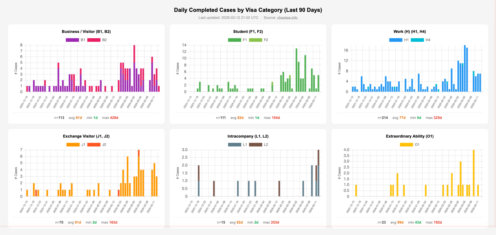

# Checkee Charts

Daily US visa administrative processing charts, auto-updated from [checkee.info](https://www.checkee.info).

**Live dashboard → https://chunhuali-1936.github.io/checkee-charts**



## What it shows

Six subplots breaking down completed cases over the last 90 days by visa category:

| Category | Visas |
|---|---|
| Business / Visitor | B1, B2 |
| Student | F1, F2 |
| Work (H) | H1, H4 |
| Exchange Visitor | J1, J2 |
| Intracompany | L1, L2 |
| Extraordinary Ability | O1 |

Each subplot shows daily case counts (stacked bar) with summary stats: total cases, avg / min / max waiting days.

## How it works

1. `generate.py` scrapes checkee.info and produces a self-contained `index.html`
2. GitHub Actions runs it daily at 8am UTC, commits the updated HTML, and GitHub Pages serves it

## Run locally

```bash
pip install -r requirements.txt
python generate.py
open index.html
```
